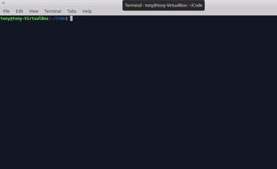
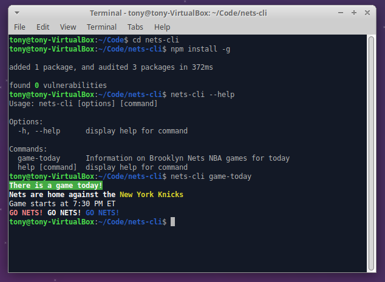

# nets-cli
A tool for information on Brooklyn Nets NBA games today

## Table of contents

- [nets-cli](#nets-cli)
  - [Table of contents](#table-of-contents)
  - [Overview](#overview)
    - [The challenge](#the-challenge)
    - [Screenshots](#screenshots)
  - [My process](#my-process)
    - [Built with](#built-with)
    - [What I learned](#what-i-learned)
    - [Continued development](#continued-development)
    - [Useful resources](#useful-resources)
  - [Author](#author)

## Overview

### The challenge

Users should be able to:
- Call ‘net-cli game-today’ and receive information on whether there is a game today, if the Nets are home or away, who the opposing team is, and when game time is.
If there is not a game then the tool will give information on when the next upcoming game is along with other information related to the event.

### Screenshots

## My process

### Built with

- NodeJS
- Commander - NodeJS CLI Framework
- Chalk - terminal string styling
- Axios - HTTP client library

### What I learned

- Role of !Shebang and specifying the absolute path & environment
- Using the Commander framework to build cli-tool

Overall this project was a great way to gain experience using NodeJS. Developing the solution from the BallDontLie API was a fun challenge and the light string manipulation has given me greater appreciation for manipulating data. 

### Continued development

In future projects I would like to continue practicing the following:
- Commenting code
- Node & JavaScript best practices

Additionally, I'd like to return to this project and implement the following:

Develop the following commands
- ‘nets-cli latest-stats’ to print player stats from the last game.
- ‘Nets-cli season-stats’ to print player stats from the overall season
- ‘Nets-cli news’ to print latest information from nets front-office

Refactor using TypeScript

## Author

- GitHub - [@Gomurmamma](https://www.github.com/Gomurmamma)
- Instagram - [@Gomurmamma](https://www.instagram.com/Gomurmamma)
